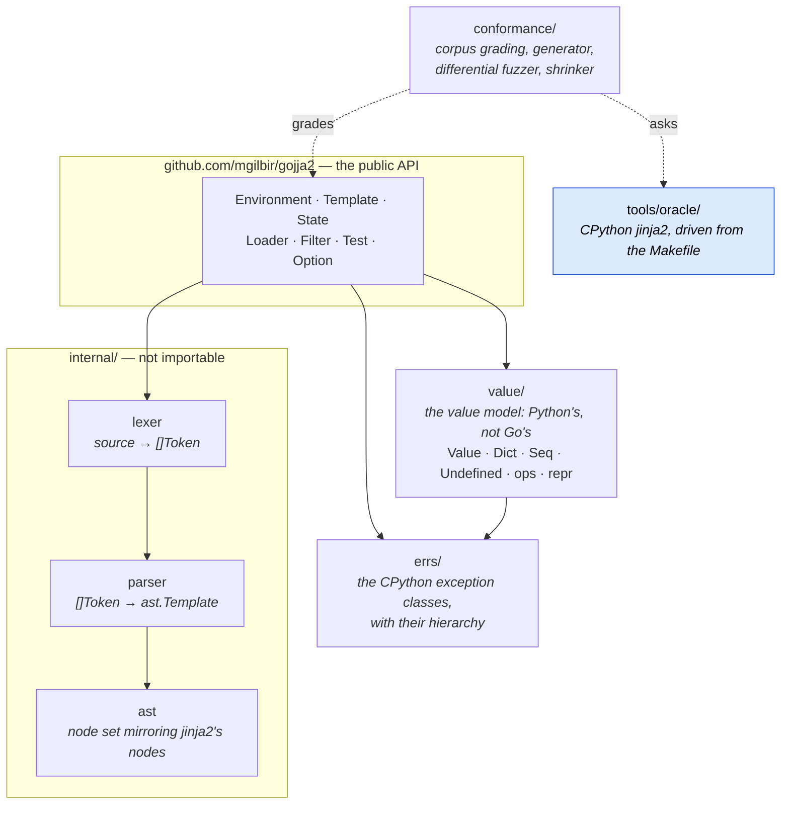
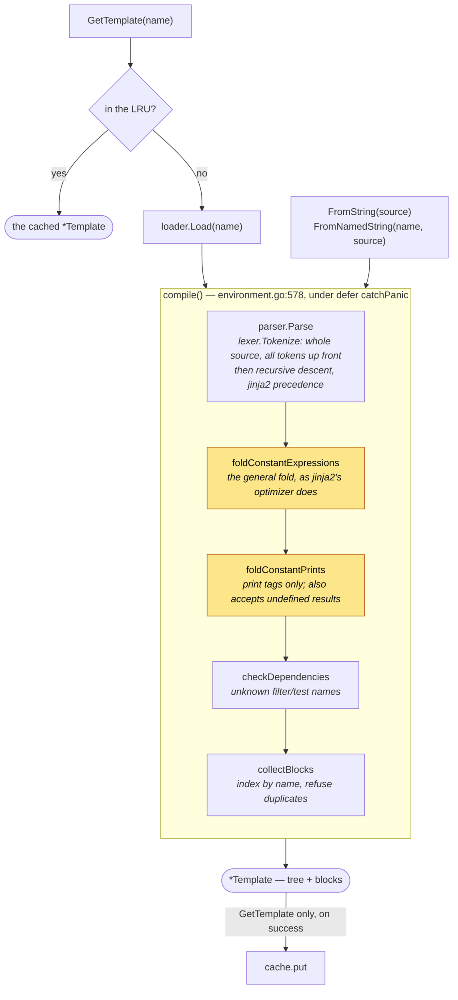
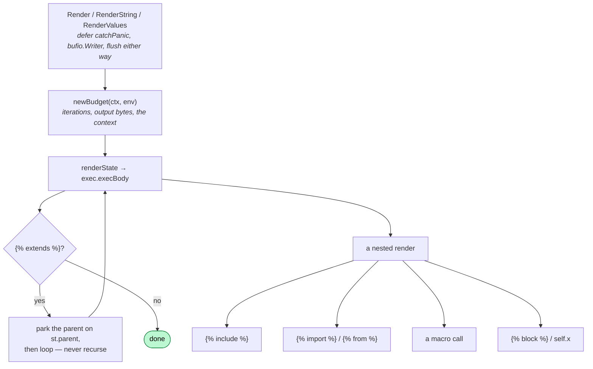
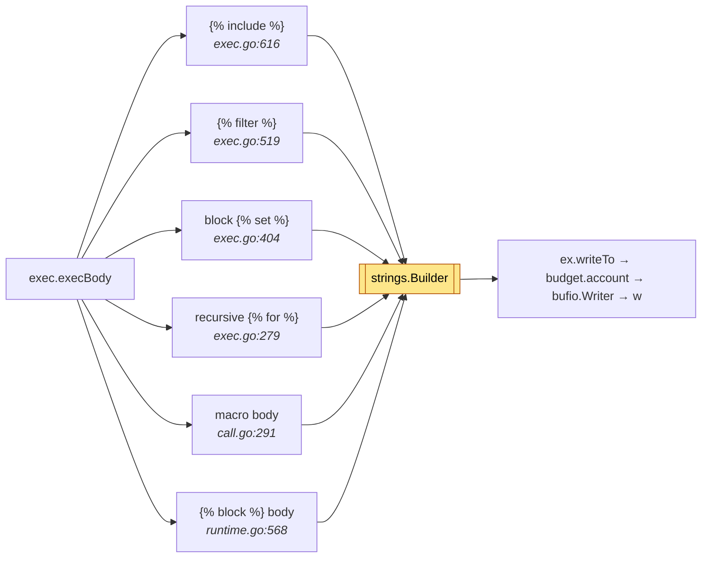
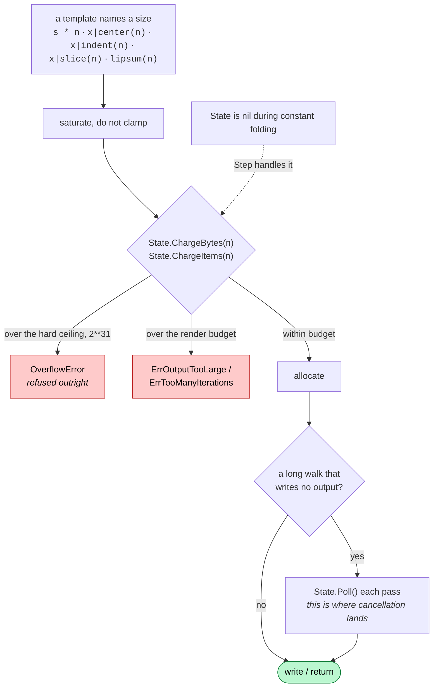

# How a template gets rendered

This is the map you want before changing anything. It covers the two paths a
template takes — compile, then render — the five ways a render nests into
another one, and the rule every allocation obeys.

It is deliberately short on prose. The shapes are the point: two of the four
Critical findings in the [2026-09-16 audit](audits/codebase-audit-2026-09-16.md)
were *shape* bugs, and both were found by drawing the second diagram below as a
table and noticing which rows disagreed.

## The packages

`value/` and `errs/` are importable because a caller writing a filter or a custom
object needs them. `internal/` is not: the token stream and the parse tree are
graded against jinja2's own, which makes them a specification to conform to
rather than an API to depend on.

## Compiling

Two things about this path catch people out.

**Compilation takes no `context.Context` and has no budget.** The bounds in
[limits.md](limits.md) are *render* bounds. What protects compile time instead is
the parser's 1,000-level nesting cap and the optimizer's refusal to fold a
constant over 64 KiB — the amber boxes run real filters, so they are the part
that can do arbitrary work.

**Only `GetTemplate` caches**, and only on success. `FromString` compiles every
time, which is why it is the wrong thing to call in a loop.

## Rendering, and the five ways it nests

The five routes are written separately, and that is where the bugs were. What
each one does with the three things that must not be dropped:

| construct | new `State`? | budget threaded | depth counted | output |
|---|---|---|---|---|
| `` | yes, via `renderInto` | yes | `st.enter()` | **buffered in full**, then written on |
| `` | no — same `State` | yes | `st.enterExtends()` | parent body replaces the child's |
| `` / `` | yes, `tmpl.newState(vars, depth, budget)` | yes | `st.enter()` | buffered; kept as the module's `str()` |
| a macro call | no — same `State` | yes | `st.enter()` | captured |
| `` / `self.x` | no — same `State` | yes | `st.enter()` | captured |

Every row now threads the budget and counts the depth. Two used not to, and this
table is how you would have seen it: `` built its `State` by hand and never
copied the budget, so an imported template rendered with *no* bound and no
context at all — not a fresh allowance, none — and `` never entered
the depth counter, so `{{ self.x }}` recursed until
the goroutine stack was exhausted. A Go stack overflow is a fatal error rather
than a panic, so `catchPanic` never saw it and the process died.

**When you add a sixth route, fill in this row first.**

### What holds output before writing it

Six constructs capture their own body rather than streaming it. Peak memory
tracks the largest of them, not the write buffer.

A filter, an assignment and a function each need finished text before they can
act on it, so each buffers. ``, block `` and the recursive
`` use `capture`; the macro and block bodies use `captureFunction`,
which also moves the *stream*, because a body is a function and not merely a
buffer. That distinction is what makes `` escape
an enclosing `` — it writes to `ex.stream` rather than `ex.out`,
reproducing a jinja2 quirk that the differential fuzzer found.

Output is charged against the budget wherever it lands, so text that passes
through two buffers is counted twice. The buffers are the memory the bound
exists to protect, so they are what has to be counted.

## Charge before you allocate

Every size a template chooses goes through this, and getting it wrong is the
single most repeated defect in this codebase's history.

Four rules, each of which has been broken at least once:

1. **Charge first.** Charging after the allocation charges for memory that is
   already gone.
2. **Charge the total, before splitting it.** Guards do not compose:
   `("a"*60000)|replace("a","b"*60000)` passed every individual guard and
   allocated 3.6 GB, and `center` charged its two halves separately, each of
   which cleared the ceiling while their sum did not.
3. **Saturate, never clamp.** Clamping a huge count down to the ceiling turns
   "refuse" into "allocate the maximum" — the same failure shape as an overflow
   wrapping negative and reading as a tiny allocation.
4. **Compile time is not exempt.** Constant folding runs real filters, with its
   own budget, reset per fold attempt — folding is observable, so it must not
   depend on how many expressions preceded it.

The hard ceiling sits *above* the budget because a zero or negative budget means
unbounded, and unbounded must still not mean "allocate 2\*\*63 bytes".

`conformance/budget_test.go` grades this generatively, and found two of the four
on its first run.

## Where the specification lives

Nowhere in this repository. CPython `jinja2`, pinned in `.venv`, is the
specification; `tools/oracle/` drives it and `conformance/` grades against it.
See the README for the corpora and the numbers, and `make ask T='...'` for
putting a question to it directly.
