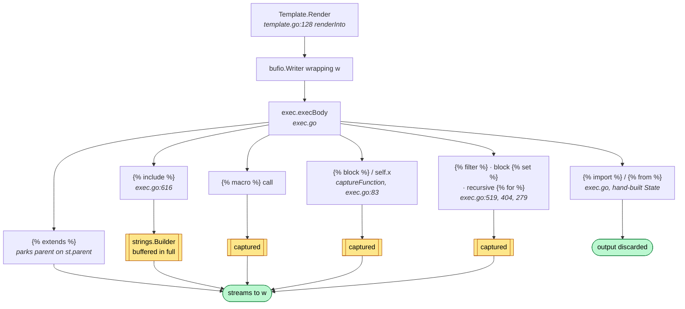
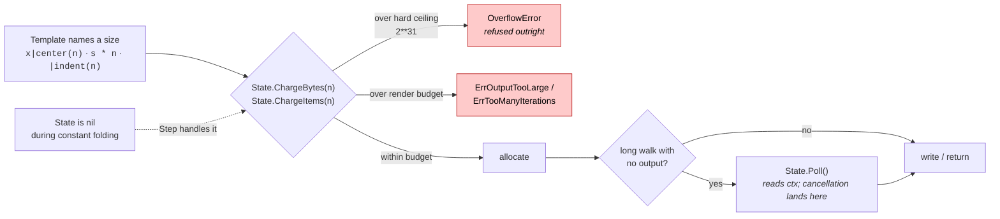
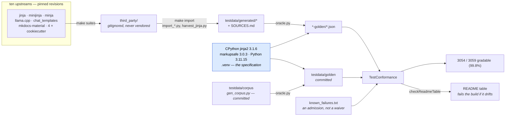
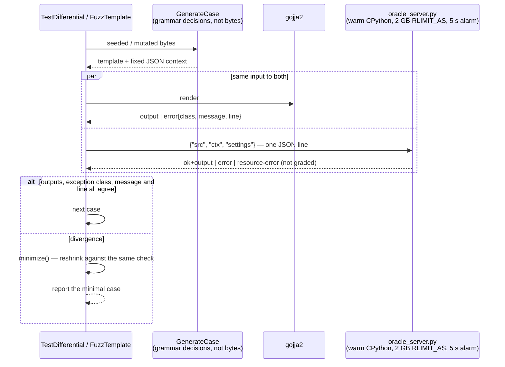

# gojja2 — documentation audit

> **This is a point-in-time snapshot of commit `9da6620`, not a description of
> the documentation as it stands.** Read the last column before acting on any
> finding.
>
> All twenty-three were re-run against `HEAD` on 2026-09-21, and **all
> twenty-three are fixed.** Twenty-two were already closed by the reorganisation
> this audit prompted -- `docs/README.md`, `docs/architecture.md`,
> `docs/extending.md`, `docs/limits.md` and `docs/contributing.md` did not exist
> when it was written. The twenty-third, D16, was closed by the re-run: `SEED=`
> was the last of its three knobs with no prose.
>
> Nothing below has been edited to match today's documentation, for the reason
> [the index](README.md) gives: an audit is a record of what was true when it was
> taken, and rewriting it destroys the only thing it is good for. The re-run is
> the column, not the text.

**Date:** 2026-09-18
**Commit:** `9da6620` "Say what `__doc__` answers, and why gojja2 does not" (working tree clean at start)
**Scope:** every reader-facing surface, read in full — `README.md` (242 lines), `docs/scope.md` (55),
`docs/divergences.md` (637), `docs/audits/codebase-audit-2026-09-16.md` (1021), `Makefile` (411),
both GitHub workflows, `NOTICE`, `.golangci.yml`, `.gitignore`, `testdata/known_failures.txt`,
the seven generated `SOURCES.md` files, `example_test.go` (6 godoc examples), the package doc
comments for `gojja2`/`value`/`errs`, the full exported API as `go doc` renders it, the 25
`tools/oracle/*.py` module docstrings, and `oracle.py --help`.

**Method.** Every accuracy claim was executed, not read. The README's usage example was compiled
and run in a throwaway module outside the repository. 36 template examples from
`docs/divergences.md` were rendered against the engine. `TestConformance`, `TestDifferential`,
`make oracle-check`, `make ask` and the full `go test ./...` were run — the heavier ones under
`systemd-run --user --scope -p MemoryMax=… -p MemorySwapMax=0`, so an allocation bomb reports as
exit 137 rather than taking the machine down. Throughput claims were measured three ways. All 30
findings of the 2026-09-16 code audit were re-run against current `HEAD`, since a committed report
is a reader-facing surface and its truth is this audit's business. Hypotheses that did not
survive — including one of my own — are in §7 rather than promoted.

**Verdict up front.** The prose is unusually accurate — this project checks its own headline number
in CI, and it holds: `TestConformance` reports exactly the 3059/3054 the README's table prints.
Almost everything that is *stated* is true. What fails is everything around the stating: there is
no diagram anywhere in the repository, one of the four docs is orphaned, another is an obsolete bug
list that reads as current, the reference doc buries its one load-bearing warning 100 lines deep,
and the entire extension API — the part with the trap in it — has no prose at all.

---

## 1. Summary

23 findings: **5 high, 8 medium, 10 low.** 22 CONFIRMED, 1 PLAUSIBLE. All 23 fixed as of 2026-09-21.

D23 was found while fixing D12, not during the read. It is recorded here rather than left in a commit message because a finding that only exists in a commit message is a finding nobody will find.

| ID | Sev | Document | Issue | Status | Re-run 2026-09-21 |
|---|---|---|---|---|---|
| D1 | High | `docs/audits/codebase-audit-2026-09-16.md` | Committed, orphaned, obsolete: 30 findings all marked CONFIRMED; all 30 re-run — 28 fixed, 1 partial, 1 never a defect, none marked so | CONFIRMED | **Fixed** — `docs/audits/README.md` indexes both reports, and the codebase audit carries a superseded banner and a per-finding Status |
| D2 | High | `README.md:21` | "streamed to `w`… with one exception: ``" — there are six buffering constructs, and `divergences.md` already says so | CONFIRMED | **Fixed** — the claim is gone; what buffers is now `docs/architecture.md`'s subject |
| D3 | High | all docs | Zero diagrams in the repository; six processes carried in prose or tables that a picture would carry | CONFIRMED | **Fixed** — mermaid diagrams in `docs/architecture.md`, `docs/contributing.md` and `docs/conformance.md` |
| D4 | High | `docs/scope.md` | Orphaned — zero inbound links; `README.md:212` restates a lossy summary of it without linking | CONFIRMED | **Fixed** — linked from `README.md`, `docs/README.md`, `docs/guide.md` and `docs/divergences.md` |
| D5 | High | (missing) | The extension API (`AddFilter`/`Func`/`State.Poll`/`ChargeBytes`) appears in no `.md`, yet `divergences.md` instructs readers to honour a contract no doc defines | CONFIRMED | **Fixed** — `docs/extending.md` |
| D6 | Med | `README.md:200` | "about 5,000 templates a second" — `make soak` measures ~640/s end to end on this machine | CONFIRMED | **Fixed** — the number is gone; no unqualified throughput claim remains |
| D7 | Med | `NOTICE`, `README.md:223` | Two upstreams named; ten are consulted. The complete record lives only in gitignored files | CONFIRMED | **Fixed** — `NOTICE` names all ten upstreams |
| D8 | Med | `docs/divergences.md:475` | The `` example does not run — `do` is opt-in, and `WithExtensions` is in no `.md` | CONFIRMED | **Fixed** — `WithExtensions` is in `docs/divergences.md` and `docs/guide.md` |
| D9 | Med | `docs/divergences.md:163,164,178` | `[ErrOutputTooLarge]` / `[ErrTooManyIterations]` / `[ErrInternal]` are godoc link syntax in Markdown; they render as literal brackets | CONFIRMED | **Fixed** — no godoc link syntax left in any `.md` |
| D10 | Med | `README.md:235` | "`make check` — what CI runs" omits CI's sixth step, the `GOMEMLIMIT=1GiB` pass | CONFIRMED | **Fixed** — `make check` is `fmt-check vet test memlimit race lint`, CI step for step |
| D11 | Med | `docs/divergences.md` | 637 lines, 23 equal-weight sections, no summary, no TOC; the one divergence that breaks working templates is at line ~100 | CONFIRMED | **Fixed** — the one that bites is now the first section, above a summary table of all twenty-three |
| D12 | Med | `docs/divergences.md` | Three genres in one flat doc: divergences (reference), safety limits (how-to, 194 lines / 30%), error-wording trivia | CONFIRMED | **Fixed** — the limits moved to `docs/limits.md`; `divergences.md` names none of the limit options |
| D13 | Low | `README.md:75` | Stale tool output: the pasted oracle JSON lacks the `case` and `oracle` blocks the tool now emits | CONFIRMED | **Fixed** — the pasted JSON carries the `case` and `oracle` blocks |
| D14 | Low | `README.md:119` | A 14-line paragraph whose "Two are…" antecedent is four clauses back; closes "for all three" after enumerating five | CONFIRMED | **Fixed** — the paragraph is gone; the section now ends in two sentences and two links |
| D15 | Low | `README.md:45` | "A structure that refers to itself" renders `{'k': 'v', 'self': {...}}` — true for a map, false for a Go struct, in a paragraph about structs | CONFIRMED | **Fixed** — the claim is gone; `docs/guide.md` states the sharing rule instead |
| D16 | Low | `Makefile`, `conformance/oracle.go:90` | `SEED=`, `C=` and `GOJJA2_ORACLE_PYTHON` all work and are documented nowhere | CONFIRMED | **Fixed** — `C=` and `SEED=` in `docs/contributing.md`, `GOJJA2_ORACLE_PYTHON` under *What watches the oracle* |
| D17 | Low | `docs/` | No index; `docs/audits/` referenced from nothing | CONFIRMED | **Fixed** — `docs/README.md` indexes `docs/`, `docs/audits/README.md` indexes the reports |
| D18 | Low | 4–5 docs | The sandbox story told 4 times, "inputs only / goldens from CPython" told 5 times, each in its own words | CONFIRMED | **Fixed** — "inputs only" is down from five docs to two, and `docs/scope.md` is the one place the sandbox story is told; the rest link to it |
| D19 | Low | (missing) | No CONTRIBUTING: no answer to "I found a divergence, now what?" | CONFIRMED | **Fixed** — `docs/contributing.md`, which opens with "I think I found a bug" |
| D20 | Low | `Makefile:253,272` | `make fmt` would rewrite pinned `third_party/` checkouts; CI excludes them, `make` does not | PLAUSIBLE | **Fixed** — `make fmt` filters `third_party/`, as CI already did |
| D21 | Low | `README.md:6` | §"Using it" is a 12-line snippet plus eight unheaded caveat paragraphs; no anchors to route to one fact | CONFIRMED | **Fixed** — §"Using it" has headed subsections and anchors |
| D22 | Low | `README.md` | 59% of the README is conformance methodology; the newcomer's questions get zero lines | CONFIRMED | **Fixed** — the README is 195 lines and conformance is 28 of them |
| D23 | Med | `docs/divergences.md:318` | Says the iteration and output bounds turn off with a "non-positive" value; zero restores the *default*, and only a negative value removes a bound | CONFIRMED | **Fixed** — `docs/limits.md` opens the section with it in bold: zero is the default, a negative value removes the bound |
---

## 2. Doc map

### Current

| Document | Lines | Claims to be | Actual audience | How it is found |
|---|---|---|---|---|
| `README.md` | 242 | Everything | Split: newcomer (26%), maintainer/evaluator (59%), contributor (7%) | Repo root |
| `docs/divergences.md` | 637 | "Deliberate divergences" | Porter, operator, maintainer — all three at once | Linked 3× from README |
| `docs/scope.md` | 55 | In/out of scope | Evaluator deciding whether to adopt | **Nothing links it** |
| `docs/audits/codebase-audit-2026-09-16.md` | 1021 | Adversarial code audit | The maintainer, on the day it was written | **Nothing links it** |
| `testdata/generated/*/SOURCES.md` | 28–126 | Corpus provenance + licence | Auditor, licence reviewer | Named in README; gitignored, absent on checkout |
| `testdata/known_failures.txt` | 60 | The five failures, with reasons | Maintainer | Named in README |
| godoc (`gojja2`, `value`, `errs`) | — | API reference | Integrator | `pkg.go.dev` |
| `example_test.go` | 6 examples | Runnable godoc examples | Integrator | godoc only |
| `Makefile` header + `## ` help | 411 | Build/oracle workflow | Contributor | `make help` |
| `.github/workflows/*.yml` | 175 | CI policy, in comments | Maintainer | Reading the YAML |

Two structural facts fall out of that table. First, **the two highest-value explanations in the
repository are in files nothing links to** (`scope.md`, and the CI fork-gate rationale buried in
YAML comments). Second, **the best-written prose in the repository is in `.py` and `.yml`
comments** — `ci.yml`'s explanation of why `-count=1` is load-bearing, `gen_ops.py`'s pool
construction, `oracle_server.py`'s sandbox rationale — none of it reachable from any doc.

### Proposed

```
README.md                      Newcomer + evaluator. Install, 12-line example,
                               "is it correct?" in one table, routes to everything else.
                               Target: ~110 lines. Cede methodology to docs/conformance.md.
docs/
  README.md            [NEW]   Index. One line per doc, by reader question.
  guide.md             [NEW]   How-to: loaders, autoescape, limits, undefined modes,
                               extensions (do/loopcontrols), cache. The 8 unheaded README
                               caveat paragraphs, given headings and anchors.        (D21)
  extending.md         [NEW]   Filters, tests, globals, custom value.Object — and the
                               charge-before-you-allocate contract, with the diagram. (D5)
  divergences.md     [SPLIT]   Reference, porter-facing only. Opens with "one divergence
                               can change what a working template renders" + a table of
                               all of them. ~420 lines.                          (D11, D12)
  limits.md            [NEW]   Operator-facing how-to, lifted from divergences.md's three
                               limit sections (194 lines): what bounds a render, which
                               option turns each off, which error each raises.        (D12)
  scope.md            [KEEP]   Unchanged content; linked from README §Scope, which becomes
                               three lines and a link.                                 (D4)
  architecture.md      [NEW]   The drawn pipeline: compile → render, the five nested-render
                               routes, the budget lifecycle. Diagrams 1, 2, 5.          (D3)
  conformance.md       [NEW]   Corpora, oracle, differential fuzzing, the numbers — moved
                               out of README. Diagrams 3, 4.                     (D22, D6)
  contributing.md      [NEW]   Add a case, regenerate a golden, what to do when gojja2 and
                               the oracle disagree, fix-vs-document.                   (D19)
  audits/
    README.md          [NEW]   "Point-in-time snapshots. Not current state." + status
                               column per past audit.                                  (D1)
    codebase-audit-2026-09-16.md  [HEADER] Superseded banner + per-finding status.      (D1)
    docs-audit-2026-09-18.md      This file.
NOTICE               [AMEND]   All ten upstreams, with licences.                       (D7)
```

Merges: none needed — nothing here is too small. `scope.md` at 55 lines is the right size for
the question it answers; the problem is that nobody can reach it.

---

## 3. Drift verification

Every accuracy claim, the exact check, the result. Claims that held are one line each.

### Held (no finding)

| Claim | Check run | Result |
|---|---|---|
| README conformance table, 3059 gradable / 3054 matching | `go test ./conformance/... -run TestConformance -v` | `3054/3059 … (99.8%); 5 known divergence(s), 4 ungradable` — exact. `checkReadmeTable` asserts every row. |
| Per-corpus rows (739/738, 159/159, 658/656, 162/162, 281/281, 810/808, 84/84, 166/166) | Same run + `find testdata/generated -name '*.jj2' \| wc -l` per corpus | All eight exact; ungradable arithmetic (160−1, 165−3) checks out |
| "The 5 that differ… `testdata/known_failures.txt`" | Read the file | 5 non-ungradable + 4 ungradable entries. Exact. |
| "repr() over 3,200 floats and strings" | `len(repr_float.json)` = 2000, `len(repr_str.json)` = 1200 | 3200 |
| "every binary operator over a 39-value pool (20,665 cases)" | `wc -l ops.jsonl` = 20666, first line is the pool header; pool indices reach 38 | 20,665 cases, 39 values |
| "token stream (113 cases)… parse tree (100 cases)" | `wc -l lex.jsonl parse.jsonl` | 113, 100 |
| "19 of the 166 wrap another templating language in ``" | grep over the corpus | 19 |
| "60 use whitespace control" | Whitespace-control regex with `` blocks stripped | 60 exactly (64 if raw blocks are counted — the doc is right) |
| "LLM chat templates × 10 conversation shapes" = 810 | `SOURCES.md` "Templates kept (81)" × 10 | 810 |
| README "Using it" example | Compiled and ran verbatim in a scratch module against a real `templates/page.html` | Renders, autoescapes (`&lt;b&gt;`) |
| `errors.Is(err, errs.UndefinedError)` works | Ran it | `true`; `Kind.Error()` + `(*Error).Is` make the whole class hierarchy work (`errors.Is(KeyError, LookupError)` = true) |
| `RenderString` "returns nothing at all when the render fails" | `bad.RenderString` on `{{ nope.attr }}` | `out="" err='nope' is undefined` |
| FSLoader refuses a `..` segment rather than cleaning it | `env.GetTemplate("../page.html")` | Not-found, `errors.Is(err, ErrNotFound)` = true. (Fixes the old audit's C19.) |
| `{{ user.Name }}` is the bound method; a trailing `error` fails the render even as the only result | Struct with `Name() string`, `Boom() error`, `Both() (string, error)` | `<bound method Name>` / `Ada`; `Boom()` → err `kaboom`; `Both()` → err `late`, no output |
| 36 template examples in `docs/divergences.md` | Rendered each against the engine | **All 36 behave exactly as documented** — complex `**` → ValueError; `` renders while `{{ 1e400 }}` prints `inf`; `\N{BULLET}` → "unknown Unicode character name"; `2**100000000` → OverflowError but `2**100` exact; `"x"*2147483648` refused; `slice(1e22)` charged not clamped; `range(-2**63,0)\|length` → "Python int too large to convert to C ssize_t" while `2**63-1` returns; `encode("cp1252")` → LookupError, `latin-1`/`xmlcharrefreplace` exact; `self\|list` → TypeError; `[1].__doc__` → empty; `__class__` for bool/Undefined/Markup; nesting bound catches both `[[[…` and `not not not …` at 1000 while `~`-chains stay flat at 2000 |
| `1.5 is sameas(1.5)` is True here, False on CPython | Both engines | gojja2 `True`; oracle `False`. Variable form `True` on both. Exact. |
| "no network and no Python" on a fresh checkout | `GOJJA2_ORACLE_PYTHON=/nonexistent/python go test -count=1 ./...` | All packages pass; oracle-dependent tests skip cleanly |
| Committed goldens still match CPython | `make oracle-check` | `739/739 goldens up to date` |
| `make ask T='…'` (the reporting channel `divergences.md` names) | `make ask T='{{ 1/2 }}'` and `make ask T='{{ a + 1 }}' C='{"a": 41}'` | `0.5`, `42` |
| CI gating prose (fork PRs need `safe-to-test`; a new push revokes it) | Read both workflows | Matches `ci.yml` `authorize` job and `revoke-approval.yml` |
| Whole suite green | `go test ./...` | 5 packages ok, 2 no-test |

### Drifted (findings)

**D2 — "one exception" is six.** README:21–23 says output is streamed "with one exception:
``". Grepping `exec.go` for the capture path finds six:

| Construct | Site |
|---|---|
| `` | `exec.go:616` (`var buf strings.Builder`) |
| `` | `exec.go:519` → `ex.capture` |
| block `` (`execAssignBlock`) | `exec.go:404` → `ex.capture` |
| recursive `` | `exec.go:279` → `ex.capture` |
| macro body | `exec.go:83` `captureFunction` |
| block body / `self.x` | `exec.go:83` `captureFunction` |

`docs/divergences.md` §"A budget on the work of one render" already states the true version —
"Output is counted wherever it lands, including text captured by ``, a block
`` or a macro body." Two docs, two answers, and the README's is the wrong one.

**D6 — throughput.** README:200: "The oracle runs as a warm subprocess — about 5,000 templates a
second rather than ten". Three measurements on this machine:

| What | Measurement | Rate |
|---|---|---|
| `make soak`, end to end (this is what a reader budgets) | `GOJJA2_FUZZ_N=20000 go test -run TestDifferential`: 19,791 templates in 31.01 s | **~640/s** |
| Warm oracle alone, real corpus templates | 2,000 cases from `testdata/corpus` driven through `oracle_server.py` in 1.16 s | ~1,730/s |
| Warm oracle alone, trivial templates (`{{ N + 1 }}`) | 4,000 round-trips in 1.01 s | ~3,950/s |

`TestDifferential`'s loop is serial and synchronous, so the end-to-end rate *is* the oracle rate on
generated input. No reading of the sentence reaches 5,000/s here. The architectural point ("rather
than ten") is sound and the ratio is real; the absolute number is the problem — a reader sizing
`make soak N=200000` computes 40 s and waits ~5 minutes. (`make soak`'s own `-timeout 60m` already
concedes this.) Rate is machine-dependent, so the fix is to qualify or drop the number, not to
substitute mine.

**D8 — the `` example does not run.** `docs/divergences.md` §"A render does not mutate the
caller's data" opens with ``. Against a default `Environment`:
`Encountered unknown tag 'do'.` — `do` is opt-in via `WithExtensions("do")`. `WithExtensions` is
mentioned in **zero** `.md` files; `README.md:216` and `docs/scope.md:17` both say "`do`,
`break`/`continue` when enabled" without saying by what. The only statement of the mechanism is
the godoc comment on `WithExtensions`.

**D13 — stale tool output.** README:75–81 prints:

```
$ .venv/bin/python tools/oracle/oracle.py --template '{{ d[1] }}'
{ "ok": true, "output": "a" }
```

Running that exact command now also emits a `"case"` field and an `"oracle"` block
(`impl`/`version`/`markupsafe`/`python`). The output is right; the shape is a version behind. In a
project whose whole thesis is provenance, the pasted example is the one place the provenance block
was dropped.

**D7 — NOTICE undercounts.** `NOTICE` names Jinja and MiniJinja and closes "Neither project's
sources are redistributed here." The `Makefile` header says "Ten upstreams", and `third_party/`
holds ten directories: `jinja`, `minijinja`, `minja`, `llamacpp`, `chat_templates`,
`mkdocs_material`, and four cookiecutters. `README.md:223` repeats the two-project framing
("gojja2 contains no code from Jinja or MiniJinja"). The per-corpus `SOURCES.md` files do record
every source, revision and licence correctly — but they live under `testdata/generated/`, which is
gitignored, so on a fresh checkout the only attribution statement in the repository is the
incomplete one. Nothing is redistributed, so this is a completeness problem, not a licence breach.

**D10 — `make check` ≠ CI.** README:235 and `Makefile:265` both claim parity.

| CI `check` job | `make check` |
|---|---|
| `gofmt -l .` (minus `third_party/`) | `fmt-check` |
| `go vet ./...` | `vet` |
| `go test ./...` | `test` |
| **`go test -count=1 ./...` with `GOMEMLIMIT=1GiB`** | **— missing —** |
| `go test -race ./...` | `race` |
| `lint` job: `golangci-lint` v2.12.2 | `lint` |

`ci.yml`'s own comment explains that the `-count=1` is load-bearing (GOMEMLIMIT is read by the
runtime, not through `os.Getenv`, so it is not in the test cache key — the step once replayed the
cache and executed no test code). That step is exactly the one a contributor cannot reproduce by
following the README. The previous audit's C24 flagged this claim; the `make lint` half was fixed
and this half was not.

**D16 — undocumented knobs.** All three work; none is documented:

| Knob | Site | Documented in |
|---|---|---|
| `make soak SEED=…` | `Makefile:265` | nothing (`make help` shows only `N=`) |
| `make ask C='{"a":41}'` | `Makefile:299` | nothing (`make help` shows only `T=`) |
| `GOJJA2_ORACLE_PYTHON` | `conformance/oracle.go:90` | nothing — not even a comment on the line |

**D23 — "non-positive" turns a safety control off. It does not.**
`docs/divergences.md:318` said the iteration and output budgets "can be turned
off with a non-positive value". Zero does not turn them off; zero restores the
default. Only a negative value removes a bound, and `WithoutLimits()` is the
spelling meant to be found.

This is not a nitpick, it is the failure mode the API was reshaped to prevent.
`WithoutLimits`' own doc comment records the history: the three limit options
used to disagree about zero, so a config struct deserialised from YAML or flags
with fields nobody set quietly disabled two of the three. That was fixed in the
code and not in the prose, so the document now describes the bug rather than the
fix — and tells a reader that the value a zeroed struct supplies is the one that
removes the bound.

Run, not read. A template looping 20,000,000 times against the 10,000,000
default:

| option | result |
|---|---|
| default | `render exceeded 10000000 loop iterations` (5.07 s) |
| `WithMaxIterations(0)` | `render exceeded 10000000 loop iterations` (5.02 s) — zero is the default |
| `WithMaxIterations(-1)` | renders, 9.95 s — negative is off |
| `WithoutLimits()` | renders, 9.96 s |

`WithMaxOutputBytes` and `WithMaxRecursion` behave the same way, checked the same
way.

**D1 — the committed audit is a time bomb.** `docs/audits/codebase-audit-2026-09-16.md` is 1021
lines, committed, and every one of its 30 findings carries `Status: CONFIRMED`. Nothing marks any
of them resolved and nothing links to the file, so a reader who opens `docs/` finds a current-tense
inventory of four Critical defects. **I re-ran all thirty.** Twenty-eight are fixed, one is
partially fixed, and one was never a defect.

Resource claims were re-run in a throwaway module under
`systemd-run --user --scope -p MemoryMax=… -p MemorySwapMax=0 -p CPUQuota=400%`, one hostile
template per invocation, reading the exit status directly — 137 would be an OOM kill, 2 a Go
stack overflow. Every one returned 0.

| ID | The audit says | Re-run today | Status |
|---|---|---|---|
| C1 | `` renders with **no budget and no context**; the bomb ran 100,000,000 iterations in 42 s and reported success | `` → `render exceeded 10000000 loop iterations` in 4.79 s, matching ``'s 4.75 s. With `WithoutLimits()` and a 2 s deadline: `render stopped: context deadline exceeded` at 2.003 s | **Fixed** |
| C2 | `{{ self.x }}` kills the process with a Go stack overflow | Prints the `BlockReference` repr, as CPython does. The explicit-call form `{{ self.x() }}` raises a bounded `RecursionError` | **Fixed** |
| C3 | Ordered comparison of cyclic values kills the process; `==` is bounded, `<` is not | `<` and `\|sort` both raise `maximum recursion depth exceeded in comparison` in 22 ms — the same error `==` gives | **Fixed** |
| C4 | `%` at compile time is unbudgeted: a 42-byte template OOM-kills `FromString` at a 4 GB cap | `env.FromString(...)` returns in 0 s, no error, under a 2 GB cap — the fold is declined and left for render time | **Fixed** |
| C5 | `\|tojson` of `-inf` calls `Builder.Reset()` and destroys the document produced so far | `KEEP{{ (-1e400)\|tojson }}` → `KEEP-Infinity` | **Fixed** |
| C6 | Lexing is quadratic in tag count; 1.6 MB compiles in 34 s | Linear: 100 KB → 16 ms, 200 KB → 34 ms, 400 KB → 66 ms, 800 KB → 128 ms. Doubling the input doubles the time where it used to quadruple it | **Fixed** |
| C7 | `StrSlice`/`StrIndex` allocate 8 bytes per input byte, uncharged — OOM-killed at 700 MB | `{{ s[0:1] }}` completes in 279 ms under the same `MemoryMax=700M`; the multibyte case in 381 ms | **Fixed** |
| C8 | The 1,000-level nesting bound does not apply to `not`, unary `-` or filter chains | All four forms trip it at 1,200 levels and all four still render at 900 | **Fixed** |
| C9 | `x in range(...)` is an uninterruptible linear scan; CPython's is O(1) | `{{ -1 in range(9223372036854775807) }}` → `False` in 0 s | **Fixed** |
| C10 | `\|unique` is O(n²) and never polls | `{{ range(60000)\|list\|unique\|length }}` → `60000` in 54 ms (was still running at 90 s) | **Fixed** |
| C11 | **No filter checks arity** | `{{ "x"\|upper(1,2,3) }}` → `do_upper() takes 1 positional argument but 4 were given` | **Fixed** |
| C12 | The memory-cap CI job runs nothing: every package replays from the test cache | `ci.yml` now passes `-count=1`, with a comment explaining why. Verified it bites: a bare re-run reports `(cached)`, two successive `-count=1` runs both execute | **Fixed** |
| C13 | `%*s` and `%.*f` are broken — the value is consumed before the star width | `{{ "%*s" % (5, "x") }}` → `"    x"` | **Fixed** |
| C14 | A large width emits Go's `%!(NOVERB)%!(EXTRA string=x)` into the document | `{{ "%2000s" % "x" }}` → clean padding | **Fixed** |
| C15 | `%` allocation is uncharged at render time too: 4 KiB budget, 10 MB built, success reported | Same template under the same 4 KiB budget → `render wrote more than 4096 bytes of output`, 0 bytes produced | **Fixed** |
| C16 | A float literal that overflows to `inf` is a syntax error | `{{ 1e400 }}` → `inf` | **Fixed** |
| C17 | `\|sum(start='')` concatenates where CPython raises `TypeError` | → `TypeError: sum() can't sum strings [use ''.join(seq) instead]` | **Fixed** |
| C18 | `"%c"\|safe % 60` emits an unescaped `<`; markupsafe raises | → `TypeError: %c requires int or char` | **Fixed** |
| C19 | `FSLoader` silently remaps `../x` to `x` instead of refusing it | `GetTemplate("../page.html")` → not-found, `errors.Is(err, ErrNotFound)` | **Fixed** |
| C20 | A method whose only result is `error` renders the error object and reports success | `{{ u.Boom() }}` → render fails with `kaboom`, no output | **Fixed** |
| C21 | `State.exported`/`export()` are write-only; the doc says imports read them | `moduleObject.GetAttr` now reads `m.st.exports` (`exec.go:771`), and the comment records what was wrong | **Fixed** |
| C22 | `Error.Stack []Frame` and `Frame` are never written or read — dead exported API | Both gone from `errs` | **Fixed** |
| C23 | `At` says "returns a copy of err" and mutates in place | The doc now says "It edits the error in place rather than copying it", and explains why that is what makes the only-if-unset rule work | **Fixed** |
| C24 | `make check` claims "Everything CI runs"; there is no `make lint`, and CI runs two more jobs | `make lint` exists and `check` depends on it. `make check` still omits CI's `GOMEMLIMIT` pass | **Partial** — closed by D10 |
| C25 | divergences.md says known_failures.txt has "only two entries"; it has four | The phrase is gone; the file now has five non-ungradable entries and the prose agrees | **Fixed** |
| C26 | `"\Uffffffff"` renders U+FFFD; CPython raises "illegal Unicode character" | → `illegal Unicode character` at compile time | **Fixed** |
| C27 | Four dead or write-only fragments the linter cannot see | `value.Hashable` now has four production callers; `methodJoin`'s `total` is gone; `checkCallerDefault` is gone; `writeStringRepr`'s `RuneError` comment now describes what the code does | **Fixed** |
| C28 | `SelectAutoescape("")` selects nothing; jinja2 builds the pattern `"."` | **The premise is wrong.** jinja2 does build the pattern `"."` — and then tests it with `str.endswith`, which matches only a name *ending in a dot*. Asked the pinned oracle directly: `select_autoescape(enabled_extensions=[""])` returns `False` for `page.anything`, `True` for `page.`, `a.b.` and `.`. gojja2 answers identically on all five. There is no divergence | **Not a defect** |
| C29 | `Globals()` hands out the live map; a caller can clobber `range` | Deleting `range` from the returned map leaves `{{ range(2)\|list }}` rendering `[0, 1]` | **Fixed** |
| C30 | `SliceBounds` and `SliceIndices` duplicate the clamp logic verbatim | `SliceIndices` is gone; `SliceSpan` delegates to `SliceBounds`, and its doc records that the clamp "used to be written out twice, character for character" | **Fixed** |

Twenty-eight fixed, one partial, one that was never real — and the document still says all thirty
are confirmed. That makes it the single most misleading page in the repository, and misleading in
the most expensive direction: it invites a contributor to "fix" what is already fixed, and it
invites the maintainer to distrust a report that was, on the whole, extremely good.

Note what C28 costs on its own. It is a finding that was marked CONFIRMED and was never checked
against the oracle this project defines as its specification — the audit reasoned from reading
jinja2's source instead of running it. I repeated that mistake in the first draft of this report by
taking C28 at face value, and only caught it by running `select_autoescape` in the pinned venv.
That is the argument for the status column: a finding nobody re-runs is a finding nobody can trust.

---

## 4. Findings by category

### 4.1 Accuracy and drift

**D1 · High · `docs/audits/codebase-audit-2026-09-16.md` (whole file) · CONFIRMED**
*Reader scenario:* a contributor opens `docs/` looking for where to help, finds thirty CONFIRMED
defects including "kills the process with a Go stack overflow", and spends an afternoon
reproducing bugs that were fixed weeks ago — or, worse, files them.
*Direction:* the document is valuable as a record and should not be deleted — 28 of its 30
findings were acted on, which is a good hit rate for an adversarial read. Add a banner at the top
("Point-in-time snapshot of commit `fa584a9`. Not a description of current behaviour.") and a
**Status** column carrying the re-run result for each finding, including the correction to C28,
whose premise does not survive contact with the oracle. Add `docs/audits/README.md` saying that
audits in this directory are snapshots and must never be read as current state.

**D2 · High · `README.md:21–23` · CONFIRMED**
*Reader scenario:* an operator sizing a container reads "peak memory tracks the largest include"
and provisions for it, then a template with a `` around a large body, or a macro that
builds a document, buffers just as much and the pod is OOM-killed.
*Direction:* replace "with one exception" with the true list, and make `divergences.md` §"A budget
on the work of one render" the canonical home (it is already correct) — the README should carry
one sentence and a link. Diagram 2 makes the set visible at a glance.

**D6 · Medium · `README.md:200` · CONFIRMED** — see §3. *Direction:* drop the absolute rate or
qualify it ("a warm interpreter answers hundreds of templates a second where a cold start answers
ten"). The ratio is the point and it survives; the number is what misleads.

**D7 · Medium · `NOTICE`, `README.md:223` · CONFIRMED**
*Reader scenario:* a licence reviewer reads `NOTICE` on a fresh checkout to answer "what third-party
work does this project touch?" and gets two of ten, because the complete answer is gitignored.
*Direction:* enumerate all ten in `NOTICE` with licences (the `Makefile` already has the repos and
revisions; the `SOURCES.md` generators already have the licences). Amend README §Licence to match.

**D8 · Medium · `docs/divergences.md:475` · CONFIRMED**
*Reader scenario:* a reader pastes the documented example to reproduce the behaviour and gets
"Encountered unknown tag 'do'", with no doc anywhere telling them what to turn on.
*Direction:* make the example self-contained (`gojja2.New(gojja2.WithExtensions("do"))`), and
document `WithExtensions` in the new `docs/guide.md` — it is the only opt-in switch in the API and
it is invisible outside godoc.

**D13 · Low · `README.md:75–81` · CONFIRMED** — *Direction:* re-paste the current output.

**D15 · Low · `README.md:45–47` · CONFIRMED**
*Reader scenario:* a reader passes a self-referential Go struct expecting
`{'k': 'v', 'self': {...}}` and gets `<main.node object>`. Verified: a self-referential **map**
renders exactly the documented form; a `*struct` renders the object repr. Both terminate, and
`{{ n.self.self.k }}` resolves on both — the safety claim is sound.
*Direction:* say "map" where the doc means a map, and state separately what a struct renders.

**D16 · Low · `Makefile`, `conformance/oracle.go:90` · CONFIRMED** — *Direction:* add `SEED=` and
`C=` to the `##` help text; give `GOJJA2_ORACLE_PYTHON` a comment and a line in the contributing doc.

**D20 · Low · `Makefile:253,272` · PLAUSIBLE**
CI runs `gofmt -l . | grep -v '^third_party/'`; `make fmt-check` runs `gofmt -l .` unfiltered and
`make fmt` runs `gofmt -l -w .`, which would rewrite the pinned upstream checkouts in place —
`third_party/minijinja/minijinja-go/` alone is ~40 Go files. Today `gofmt -l .` is empty with all
ten clones present, so it does not bite; it is latent, and `make help` describes `fmt` as "Format
Go sources" with no warning. *Direction:* apply CI's exclusion in the Makefile so the two agree.

### 4.2 Inverted pyramid

**D11 · Medium · `docs/divergences.md` (whole file) · CONFIRMED**
*Reader scenario:* "I am porting a working jinja2 project to gojja2. What will render differently?"
The doc answers this — in §"Lazy sequence filters", around line 100: *"This is the one divergence
here that can change what a working template renders."* Everything before it (complex numbers,
`1e400`, `\N{...}` — 47 lines) is unreachable-in-practice trivia, and the 500 lines after it are
safety controls and error-wording. The single sentence a porter needs is behind 85 lines of things
they will never hit.
*Direction:* open with a two-paragraph "what this is / what will actually bite you", then a table
of every divergence with a **Can this change a working template?** column (the answer is "yes" for
exactly one row), then the sections in that order. Rationale last.

**D21 · Low · `README.md:6–68` · CONFIRMED**
*Reader scenario:* "Does `FromString` autoescape?" The answer is at line 50, in the fifth of eight
unheaded paragraphs, with no anchor to link and no heading to scan.
*Direction:* move the eight paragraphs to `docs/guide.md` under headings (Loading · Go values ·
Methods · Autoescaping · Limits · Caching) and leave the README with the snippet plus a
five-bullet "what you need to know" and links.

**D14 · Low · `README.md:119–132` · CONFIRMED**
One 14-line paragraph doing four jobs. It opens "The 5 that differ are listed…", interposes a
sentence about `TestConformance` ending in the dangling "— it had.", then resumes "Two are Jinja's
own sandbox-escape tests" — antecedent four clauses back — and closes "See docs/divergences.md for
all three" immediately after enumerating five. ("Three" means three *categories*; nothing says so.)
*Direction:* three short paragraphs, one per category, and move the `TestConformance` self-check
note to sit with the table it guards.

### 4.3 Sizing and decomposition

**D12 · Medium · `docs/divergences.md` · CONFIRMED**
Three genres share one flat heading level:

| Genre | Sections | Lines | Real reader |
|---|---|---|---|
| Behavioural divergences | Complex numbers, `1e400`, `\N{}`, lazy filters, `sameas`, `self\|list`, no-mutation, no auto-reload, identifier chars, lipsum, introspection, macro+include, sort order, codecs, `pprint`, repr addresses, `len(range)` | ~380 | Porter |
| Safety controls (configuration, not divergence) | Limits on allocation (88), nesting depth (70), budget on one render (36) | **194 (30%)** | Operator |
| Error-wording trivia | The three CPython recursion messages and why one was picked | ~40 | Maintainer |

The doc says as much about itself: "Like the nesting bound, this is a safety control rather than a
behavioural choice." Three of its largest sections are not divergences at all.
*Direction:* split the 194 lines into `docs/limits.md` — an operator's how-to: what bounds a
render, which option adjusts each, which error each raises, what `WithoutLimits()` gives up — and
leave `divergences.md` at ~420 lines of porter-facing reference, cross-linked both ways.

### 4.4 Architecture as drawn process

**D3 · High · every doc · CONFIRMED**
`grep -rniE 'mermaid|<svg|\.svg|\.png'` over `README.md`, `docs/*.md` and `docs/audits/*.md`
returns nothing. Not one picture. Six processes are carried in prose or ASCII tables instead — see
§5 for the four drafted and two backlogged. The most expensive absence is the nested-render routes:
the 2026-09-16 audit reconstructed them as a five-row table and observed that *"the two that were
written by hand rather than through `renderInto` are the two that are missing a guard"* — that is
a shape argument, made in a table, about two Critical bugs. A diagram would have shown it.

### 4.5 Usefulness and audience fit

**D22 · Low · `README.md` · CONFIRMED**
Line budget: §Using it 63 (26%), §Ground truth 29, §Conformance 87, §Differential fuzzing 27
(**143 = 59% methodology**), §Scope 7, §Licence 8, §Development 16.
*Reader scenario:* a Go developer evaluating the library asks "which filters and tests are
implemented?", "how do I expose my own type?", "how fast is it?" — three questions, zero lines,
while the corpus-import methodology gets eighty-seven.
The 59% is genuinely the project's best argument and must not be lost; it is simply addressed to a
different reader. *Direction:* move it to `docs/conformance.md` and leave the README with the
headline table, the 99.8% and a link.

**D5 · High · missing · CONFIRMED**
`AddFilter`, `AddTest`, `AddGlobal`, `Func`, `Filter`, `Test`, `RenderValues`, `SelectTemplate`,
`FromNamedString`, `WithUndefined`, `WithFinalize`, `WithPolicies`, `WithExtensions`,
`ChoiceLoader`, `DictLoader`, `PrefixLoader`, `value.Object` and the whole `State` API appear in
**zero** `.md` files (grep count: 0 each). godoc covers them individually and covers them well —
`Func`'s comment carries the real warning: *"must charge it with State.Step before doing so —
charging afterwards is useless, because by then the memory is already committed. It is nil during
constant folding."*
*Reader scenario:* `docs/divergences.md` §"How promptly a cancelled render stops" tells the reader
"A filter registered by a caller that loops without writing output should poll too; one that does
not is a region nothing can interrupt." That is an instruction to honour a contract — `State.Poll`,
`ChargeBytes`, `ChargeItems`, `Step`, and the rule that charging follows allocation — that no
document defines, and that the code audit shows is the single most-violated invariant in the
engine (C1, C4, C7, C15 were all "a template-chosen size allocated before it was charged").
*Direction:* `docs/extending.md`, with the four `State` methods, when each applies, the nil-`State`
folding case, and Diagram 5.

### 4.6 Coverage

There is no CLI, no config file and no environment configuration in the library, so the usual
gaps do not apply; the public surface is the Go API and the `make` workflow. Against those:

| Surface | Documented? |
|---|---|
| Core render path, loaders, autoescape, limits, cache | README prose + godoc — adequate |
| Error model (`errs.Kind` hierarchy, `errors.Is`, `Error.Detail()`, `Limit`) | godoc only; `Detail()` and the `Limit` field mentioned in no `.md` |
| Extension API | **Nothing** (D5) |
| `WithExtensions` (`do`, `loopcontrols`) | godoc only (D8) |
| Undefined modes (`value.UndefinedBehavior`) | One godoc example; no doc lists the modes or maps them to jinja2's classes |
| `make` targets | 6 of 28 in the README; `make help` covers all, `SEED=`/`C=` undocumented (D16) |
| `GOJJA2_ORACLE_PYTHON` | Nowhere (D16) |
| Troubleshooting / "it diverges, now what" | **Nothing** (D19) |
| ADRs for non-obvious decisions | None as such. `divergences.md` and `scope.md` are doing ADR work informally, and doing it well — the sandbox rationale in `scope.md` is a model ADR that visibly supersedes an earlier wrong justification. Worth naming as such. |

**D19 · Low · missing · CONFIRMED** — no `CONTRIBUTING.md`, no `.github/*.md`. README §Development
is 16 lines of `make` targets. A first-time contributor has no answer to: how do I add a
conformance case (`gen_corpus.py` — and per project convention cases must live *there*, not be
hand-written); how do I regenerate one golden; how do I tell a bug from a deliberate divergence;
what gets a `known_failures.txt` entry versus a fix. The material exists — scattered across the
`Makefile` header, `known_failures.txt`'s preamble and `gen_corpus.py` — and is never assembled.

### 4.7 Single source of truth

**D18 · Low · CONFIRMED**

| Fact | Told in | Canonical home |
|---|---|---|
| The sandbox / `__subclasses__` / `__import__` story | `README.md:123`, `docs/scope.md:28–48`, `docs/divergences.md` §"Python object introspection", `testdata/known_failures.txt:17` — **four** wordings | `docs/scope.md`; the others link |
| "Inputs only; every golden regenerated from pinned CPython jinja2" | `README.md:115`, `Makefile:10–13`, `NOTICE`, every `SOURCES.md`, `known_failures.txt` — **five** | `docs/conformance.md`; `SOURCES.md` is generated so it may restate |
| The `1e400` folded constant | `README.md:128`, `divergences.md` §"A constant…", `known_failures.txt:47` | `divergences.md` |
| The 400-entry LRU | `README.md:66`, `divergences.md` §"No automatic template reload", godoc on `WithCacheSize` | godoc |
| Which constructs buffer output | `README.md:21` (**wrong**) and `divergences.md` §"A budget…" (right) | `divergences.md` — see D2 |
| Scope | `README.md:212–218` and `docs/scope.md`, unlinked | `docs/scope.md` — see D4 |

Terminology is consistent throughout — "gradable", "ungradable", "corpus", "oracle", "divergence",
"budget" mean one thing each in every document. That is better than most projects manage and is
worth preserving explicitly in a short glossary in `docs/README.md`.

### 4.8 Findability

**D4 · High · `docs/scope.md` · CONFIRMED**
`grep -rn "scope\.md"` across `README.md`, `docs/`, the `Makefile` and all `.go` files returns
nothing outside the audit file. The doc is unreachable except by listing the directory. Meanwhile
`README.md:212–218` restates its subject in seven lines — losing the async, i18n, bytecode-cache
and sandbox reasoning entirely, including the passage where the project corrects its own earlier
justification.
*Reader scenario:* an evaluator asks "does it do async rendering?" The README's §Scope does not
say. `docs/scope.md` says clearly, and they will never find it.
*Direction:* README §Scope becomes three lines and a link.

**D17 · Low · `docs/` · CONFIRMED** — no `docs/README.md`; `docs/audits/` is referenced from nothing.
*Direction:* an index keyed by reader question, not by filename.

**D9 · Medium · `docs/divergences.md:163, 164, 178` · CONFIRMED**
`[ErrOutputTooLarge]`, `[ErrTooManyIterations]` and `[ErrInternal]` are Go doc-link syntax. In a
`.md` file on GitHub they render as literal bracketed text pointing nowhere.
*Reader scenario:* a reader hits `ErrOutputTooLarge`, sees what looks like a link in the one doc
that explains it, clicks nothing.
*Direction:* real links to `pkg.go.dev/github.com/mgilbir/gojja2#ErrOutputTooLarge`, or plain
backticks. These three are the only dead references in the first-party docs — the four real
Markdown links (`README.md:3,64,131`, `docs/scope.md:26`) all resolve.

---

## 5. Diagram backlog

In value order. The first four are drafted; all Mermaid below was written against the code, not
from the prose. All four parse cleanly under Mermaid 11 (`mermaid.parse`, the parser GitHub
renders with); the validator was itself checked against a deliberately malformed diagram to be
sure it can fail.

### 1. The five nested-render routes → `docs/architecture.md`

Highest value: this is the shape that produced two Critical bugs, and the shape D2 gets wrong.
Four facts per route — new `State`? budget threaded? depth counted? output buffered? — that a
table states and a picture shows.



> Caption to sit under it: **everything amber is held in memory in full before it is written on.**
> `README.md:21` currently names only the first of them.

### 2. Charge before you allocate → `docs/extending.md`

The invariant the code audit found violated four separate ways, and the one a filter author must
honour. Nothing draws it today.



> Caption: **charge first, allocate second.** Charging after the allocation charges for memory that
> is already gone. A zero or negative budget means "unbounded", which is still not "allocate 2^63
> bytes" — hence the hard ceiling above the budget.

### 3. Where a conformance number comes from → `docs/conformance.md`

87 README lines of prose describing a pipeline. One picture replaces most of it and makes the
"inputs only, goldens always from CPython" invariant visible rather than asserted five times (D18).



> Caption: only the upstreams' **inputs** cross into the corpus. Every expected output on the right
> is produced by the interpreter in the blue box. `go test ./...` on a fresh checkout runs the
> bottom-left path only — no network, no Python.

### 4. The differential loop → `docs/conformance.md`



> Caption: a resource error from the oracle sandbox says the *server* ran out of room, not that the
> template is wrong, so it is excluded rather than graded.

### 5. Backlog — compile → render pipeline → `docs/architecture.md`

`FromString`/`GetTemplate` → LRU probe → `catchPanic(` Tokenize → recursive-descent Parse →
`foldConstantExpressions` → `foldConstantPrints` → `checkDependencies` → `collectBlocks` `)` →
store on success only; then `Render` → `renderInto` → `State` + `bufio.Writer` → `exec`, with
`` looping rather than recursing. The 2026-09-16 audit reconstructed this as an
ordered list; a flowchart belongs in the architecture doc, with the two separate `recover` points
(entry backstop vs. the quieter constant-folding one) marked.

### 6. Backlog — the CI fork gate → `docs/contributing.md`

A `stateDiagram-v2` over: fork PR opened → *waiting for approval* → maintainer adds `safe-to-test`
→ *trusted, CI runs* → contributor pushes → `revoke-approval.yml` strips the label → back to
*waiting*. The reasoning is already written, and written well, in `ci.yml`'s comments — where no
contributor will read it.

---

## 6. Missing-docs backlog

By unblocking value.

1. **`docs/extending.md`** (D5) — filters, tests, globals, `value.Object`, and the
   charge-before-allocate contract with Diagram 2. Unblocks every integration beyond the built-ins,
   and closes the gap where `divergences.md` instructs readers to honour a contract no doc defines.
2. **Status pass on `docs/audits/codebase-audit-2026-09-16.md` + `docs/audits/README.md`** (D1) —
   cheapest high-value fix in the list. One banner and one column.
3. **`docs/README.md`** (D17, D4) — index by reader question. Rescues `scope.md` from orphanhood
   and gives the split docs somewhere to hang.
4. **`docs/architecture.md`** (D3) — Diagrams 1, 2, 5. The first document a new contributor should
   read, and it does not exist.
5. **Restructure `docs/divergences.md`** (D11, D12) — summary + impact table on top, 194 lines of
   limits out to `docs/limits.md`.
6. **`docs/guide.md`** (D21, D8) — the eight unheaded README caveat paragraphs, given headings,
   plus the undefined modes and `WithExtensions`.
7. **`docs/conformance.md`** (D22) — the 143 methodology lines, plus Diagrams 3 and 4.
8. **`docs/contributing.md`** (D19) — add a case, regenerate a golden, fix-vs-document, the
   `make` workflow in full, the CI fork gate (Diagram 6).
9. **`NOTICE` amendment** (D7) — ten upstreams with licences.
10. **A worked "custom Go type" example in `example_test.go`** — the six existing examples cover
    strings, structs, inheritance, autoescape, dict keys and errors; nothing shows `value.Object`,
    which is the extension point with the largest surface.
11. **A glossary** in `docs/README.md` — "gradable", "ungradable", "corpus", "oracle", "profile",
    "budget". The terms are already used consistently; write them down before they drift.

---

## 7. Open questions

For the maintainer; I could not settle these from the code or the history.

1. **Is the committed audit meant to be a durable artifact or a working note?** The answer decides
   D1's fix: a durable record wants a status column and an index; a working note wants moving out
   of `docs/` entirely. It currently reads as neither.
2. **Was "about 5,000 templates a second" (D6) measured on the oracle in isolation, or end to end,
   and on what hardware?** My three measurements bracket it at 640–3,950/s. If it was an
   isolated-oracle figure on a faster machine it is defensible and just needs its scope stated.
3. **Should `make check` gain the `GOMEMLIMIT` pass, or should the README stop claiming parity?**
   (D10.) Either closes it; the second is free.
4. **C24 is the only finding from the 2026-09-16 audit still open**, and only in its second
   half: `make check` omits CI's `GOMEMLIMIT` pass. D10 closes it. Worth confirming that is the
   shape you want rather than relaxing the README's claim.
5. **Does the project want a published `pkg.go.dev` presence as the primary API reference?** If so,
   D5's `docs/extending.md` should be thin and point at godoc; if not, it needs to carry the whole
   contract itself.
6. **`gojja2.test`** — a 9.8 MB test binary sits in the repo root. Untracked (`.gitignore` has
   `*.test`), so harmless, but worth a `make clean` sweep. Not a docs finding; noted because I
   tripped over it while building the doc map.

### Hypotheses that did not survive

Recorded so the next reader does not spend the time again.

- **C28 of the 2026-09-16 audit — `SelectAutoescape("")` selects nothing where jinja2 escapes
  everything.** I carried this forward as "still live" in the first draft of this report, on the
  strength of the earlier audit's CONFIRMED marking, and it is wrong. jinja2 builds the pattern
  `"."` and then applies `str.endswith`, which matches only a name ending in a dot. Asked the
  pinned interpreter: `select_autoescape(enabled_extensions=[""])` gives `False` for
  `page.anything` and `True` for `page.`, `a.b.` and `.`. gojja2 gives the same five answers.
  Believing a prior CONFIRMED without re-running it is the exact failure this report accuses the
  old audit of enabling; it took one command to disprove.
- **"The README conformance table has drifted."** It has not, and it structurally cannot:
  `checkReadmeTable` (`conformance/conformance_test.go:232`) parses the README and fails the build
  on any row that disagrees with the measured tally. Verified by running it — 3054/3059, exact.
  Then verified that the guard is not decorative: changing the README total to `**3060**` and
  re-running gave `README conformance total is out of date. expected row: | **total** | **3059** |
  **3054 (99.8%)** |` and `FAIL`. README restored; `git diff README.md` clean. This is the best
  documentation control in the repository, and it is a real one.
- **"`make ask` is broken or renamed"** — `divergences.md` tells readers to report bugs with
  `make ask T='...'`. Both `T=` and the undocumented `C=` work; only the discoverability of `C=`
  is a finding.
- **"60 use whitespace control" is off by four.** My first grep said 64. The difference is exactly
  the four cases whose only `` markers sit *inside* a `` block, where they are
  not whitespace control at all. Re-measured with raw blocks stripped: 60. The README is right.
- **"`|tojson` of `+inf` is also broken"** (carried over from the previous audit's own disproof) —
  and more to the point, the negative branch is fixed too: `KEEP{{ (-1e400)|tojson }}` renders
  `KEEP-Infinity`.
- **"The `docs/divergences.md` examples have rotted."** 36 of 36 render exactly as documented,
  including the fiddly ones — the `2**63-1`/`2**63` boundary on `len(range(...))`, the `~`-chain
  staying flat at depth 2000 where `not not not …` trips the 1000-level bound, and
  `1.5 is sameas(1.5)` disagreeing with CPython in the documented direction. This file is the most
  accurate thing in the repository; its problems are entirely structural.
- **`make fmt-check` fails once the suites are cloned.** It does not: `gofmt -l .` is empty with all
  ten upstreams present, including `third_party/minijinja/minijinja-go/`'s ~40 Go files. The
  divergence from CI's filter is real but latent — hence D20 is PLAUSIBLE, not CONFIRMED.
- **The README's "no network and no Python on a fresh checkout" claim is aspirational.** It holds:
  with `GOJJA2_ORACLE_PYTHON` pointed at a nonexistent interpreter, `go test -count=1 ./...` passes
  all five packages and the oracle-dependent tests skip cleanly via `ErrNoOracle`.
