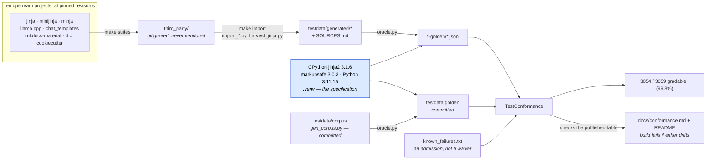
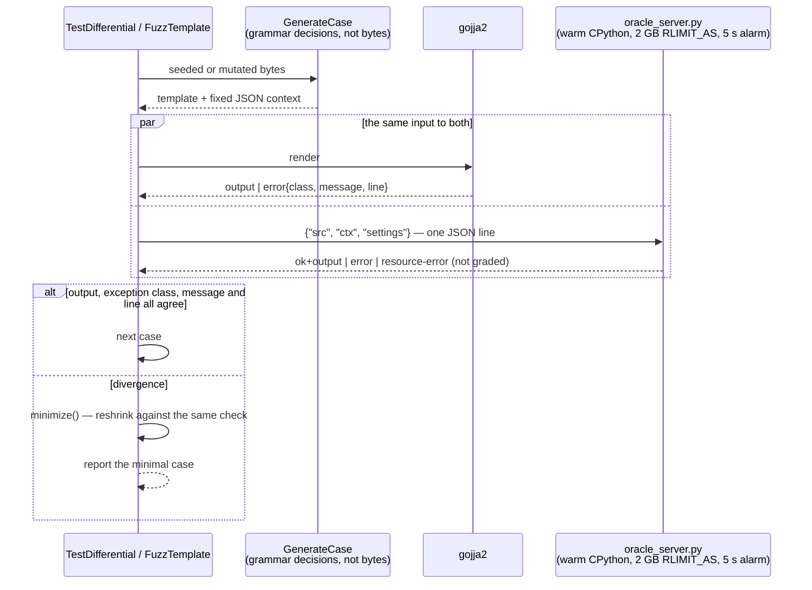

# How correct is it, and how do we know?

**3158 of 3166 gradable cases (99.7%)** match CPython jinja2, across eight
corpora from ten upstream projects. The five that do not are listed with reasons
in `testdata/known_failures.txt`, and a case on that list which starts passing
fails the build.

This page is the method behind that number. If you only want the number, the
README has it; if you are deciding whether to trust it, read on.

## Where the answers come from

CPython `jinja2`, pinned in `.venv`, **is** the specification. Nothing in this
repository asserts what a template *should* render; every expected output is
recorded by rendering the template with the real thing.



Only the upstreams' **inputs** cross into a corpus. Every expected output on the
right comes from the blue box, so where an upstream disagrees with CPython, the
upstream is wrong here and its own answer is discarded.

`go test ./...` on a fresh checkout runs the bottom-left path only: the first
corpus is committed with its goldens, so it grades against CPython's answers with
no network and no Python.

## The corpora

| corpus | gradable cases | matching CPython jinja2 |
|---|---|---|
| gojja2's own (committed, with goldens) | 846 | 842 |
| MiniJinja fixtures | 159 | 159 |
| Jinja's own test suite (harvested templates) | 658 | 656 |
| minja's syntax tests | 162 | 162 |
| llama.cpp's Jinja tests | 281 | 281 |
| LLM chat templates x 10 conversation shapes | 810 | 808 |
| A documentation theme's templates | 84 | 84 |
| Cookiecutter project templates | 166 | 166 |
| **total** | **3166** | **3158 (99.7%)** |

Each imported corpus is a different project's independent reading of the
language -- MiniJinja (Rust), minja (C++), llama.cpp's own engine, the
templates real models ship, a theme written to be used rather than tested, and
four project generators. Only their *inputs* are used: every expected output is
regenerated from the pinned CPython jinja2, because that is the specification.
On top of that, roughly a million generated templates have been rendered by both
implementations and compared (see below).

Those numbers are not typed in by hand. `TestConformance` parses this page *and*
the README's headline figure, and fails the build on anything that disagrees
with what it just measured -- whenever every corpus is present, since `make
import` is what builds most of them. It does that because the table had drifted,
twice, after cases were added and the prose was not.

The 5 that differ are listed, with reasons, in `testdata/known_failures.txt`. A
case on that list which starts passing also fails the test, so the list can only
shrink deliberately.

They are three kinds. **Two** are Jinja's own sandbox-escape tests, which walk a
Python object graph out to `__subclasses__` and `__import__`; `__class__` *is*
implemented, and these two go past it. **Two** are DeepSeek-R1's chat template,
which writes `{{ tools|map(attribute='function')|tojson }}` -- jinja2's `map`
returns a generator, which `json.dumps` refuses, so the template raises under
CPython and renders under gojja2. **The fifth** is ``: jinja2
writes a folded constant into its generated Python as that constant's repr, and
`repr(float("inf"))` is the bare word `inf`, so the template raises a NameError
there and renders here. All three are explained in
[divergences.md](divergences.md).

Four further cases are marked *ungradable* and left out of the table: they
render a generator's memory address, which differs between two runs of CPython
itself, so jinja2 does not match them either. Nothing else is excluded -- a case
gojja2 simply fails stays in the denominator.

Underneath, the pieces are graded separately against the real thing: CPython's
`repr()` over 3,200 floats and strings, every binary operator over a 39-value
pool (20,665 cases), jinja2's own token stream (113 cases) and its own parse
tree (100 cases).

The first corpus is committed with its goldens, so `go test ./...` grades
against CPython's answers on a fresh checkout with no network and no Python.
Run `make suites && make import` to add the rest: the upstream repositories are
cloned at pinned revisions into the gitignored `third_party/`, and the cases and
their goldens are built into the gitignored `testdata/generated/`. Nothing from
those projects is vendored or committed, and each generated corpus carries a
`SOURCES.md` recording where it came from, under what license, and which inputs
were dropped and why.

Cookiecutter templates are the one corpus that arrives with a context already
written: `cookiecutter.json` is one, in JSON, chosen by the template's author.
They contribute the shape of a template that generates a *file* -- 19 of the
166 wrap another templating language in ``, and 60 use whitespace
control -- which the chat templates and the theme between them do not reach.

The theme's templates arrive without any context at all -- a theme gets one from
MkDocs, not from a file next to it. Each context is synthesised by rendering
the template twice: once against proxies that record every access, and once
against the plain JSON that recording reads back as, requiring the two to agree
byte for byte. A template needing something JSON cannot express -- a host
filter, a callable -- is not guessed at; it is dropped, and `SOURCES.md` says
why. That dropped list is a deliverable in its own right: it is the catalogue
of what a JSON-context corpus structurally cannot reach.

`make import` also writes `testdata/generated/minijinja-divergences.md`, which
costs nothing and is worth having: MiniJinja ships a snapshot of what *it*
renders for each of its fixtures, and the CPython goldens for those same
fixtures are already recorded here. Of the 159 compared, 58 agree, 44 are
rejected by both with different wording, and 57 genuinely diverge -- MiniJinja
renders `range(3) * 3` and a case-insensitive `dictsort` where CPython raises,
among others. gojja2 matches CPython on every gradable one, which is the useful
part: those are the constructs two independent implementations read
differently, so they are where a third is most likely to be wrong.

Chat templates are not written against a bare environment -- `transformers`
gives them `trim_blocks`, `lstrip_blocks`, `loopcontrols`, a `tojson` that does
not sort keys or escape HTML, and the `raise_exception` and `strftime_now`
globals. A case records that as `"__profile__": "transformers"`, implemented
once for the oracle and once for gojja2, with `TestProfileMatchesOracle` pinning
the two together so they cannot drift apart unnoticed.

## Differential fuzzing

A corpus only covers what someone thought to write down. `make soak` generates
templates from the grammar, renders each with both implementations, and
requires them to agree on everything -- output, exception class, message and
line:

```
make soak N=200000      # seeded run, reproducible
make fuzz TIME=5m       # coverage-guided, via go test -fuzz
make fuzz-props TIME=5m # properties only, no oracle -- what CI runs
```

Generation is structured rather than byte-level: random bytes are read as
*grammar decisions*, so almost every case renders instead of being a syntax
error, and a mutation changes one choice rather than corrupting a tag. A
divergence is shrunk against the same check before it is reported, so findings
arrive minimal.

The oracle runs as a warm subprocess. That is what makes a soak practical at
all: starting an interpreter and importing jinja2 per case costs tens of
milliseconds, which caps a cold run at a few tens of templates a second, where
keeping one up runs into the hundreds. Budget minutes for
`make soak N=200000`, not seconds -- which is why the target allows itself an
hour. The subprocess runs under a memory cap and a per-render timeout, so a
pathological case degrades to an error instead of taking the machine down.

This is where most of the subtler behaviour in this list came from: that
jinja2 wraps a sort key in a list (so two undefineds sort but do not compare),
that `` bypasses an enclosing filter buffer,
and that a name assigned anywhere at template level is invisible to nested
scopes until the assignment runs.

## The differential loop, drawn



A resource error from the oracle's sandbox — `MemoryError`, `RecursionError`,
a timeout — says the *server* ran out of room, not that the template is wrong,
so it is excluded rather than graded. jinja2 has no bounds: `{{ "x" * 2**40 }}`
allocates until something outside the process stops it, and an unguarded oracle
takes the machine with it. Both entry points run under those limits now — the
batch tool that writes goldens as much as the server, since generating goldens
is exactly when nobody is watching.

**`OverflowError` is not one of them.** `Python int too large to convert to C
ssize_t` is what CPython says about an *argument*, on any machine and every
time; it is the answer, not a symptom of how much room this process had. It
was listed as a resource error, so the fuzzer and the soak discarded every case
that raised it — while the batch tool, which classified nothing, recorded the
same exception as the expected answer and graded it. One exception was the
specification on one path and noise on the other, and the gap was where a whole
family of integer-argument divergences lived: a 36-case sweep reported 2
divergences with it listed and 23 without.

What counts as a resource error is defined once, in `tools/oracle/jinjaoracle.py`,
and both entry points import it. Writing a golden asks a narrower question —
`MemoryError` and a timeout are this machine's answer and can never be recorded,
while a `RecursionError` from a template that recurses infinitely is CPython's
and two committed goldens hold it. That is reproducible only because both paths
now pin the same recursion limit; the server used 3,000 and the batch tool
CPython's default 1,000.

## Reproducing any of this

```
make venv                 # CPython + the pinned jinja2
make suites               # clone the ten upstreams (gitignored)
make import               # build every corpus and record jinja2's answers
make conformance          # the pass rate, per corpus
make oracle-check         # do the committed goldens still match CPython?
make soak N=200000        # differential, seeded and reproducible
make fuzz TIME=5m         # differential, coverage-guided
make ask T='{{ 1/2 }}'    # ask the oracle one question
```
