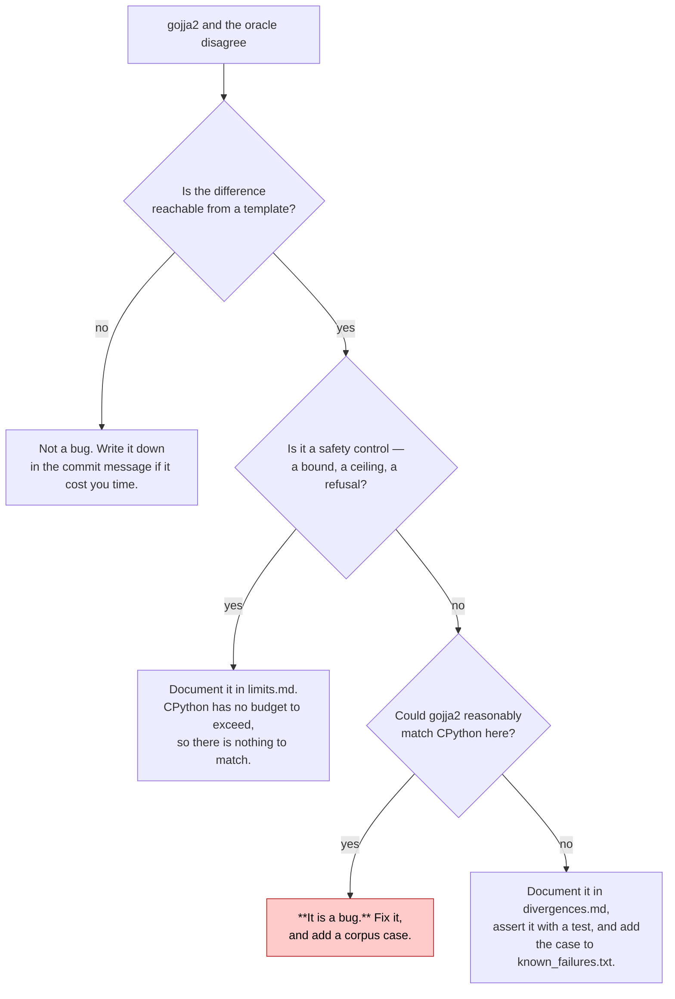
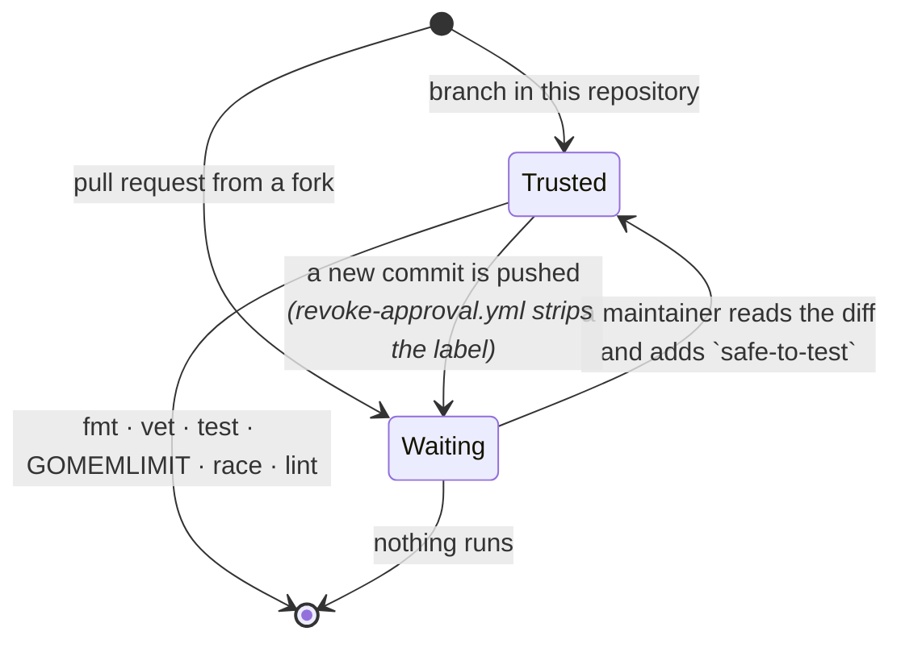

# Contributing

The short version: **CPython jinja2 is the specification, so start by asking
it.** Almost every change here begins with `make ask` and ends with a
conformance case.

## Setting up

```
make venv       # CPython + the pinned jinja2, into .venv
make test       # grades the committed corpus; needs neither network nor Python
make suites     # clone the ten upstreams (gitignored, a few minutes)
make import     # build the other seven corpora and record jinja2's answers
```

`make test` works on a fresh checkout because the first corpus ships with its
goldens. Everything else is optional until you want the full pass rate.

## The gate before every commit

```
make check
```

That is `fmt-check vet test memlimit race lint`, in CI's order, and it is
everything CI runs. If it passes and CI does not, that is a bug in the Makefile
and worth reporting on its own.

**Run it under a cgroup cap.** This suite deliberately renders hostile templates
— `{{ range(10000000000)|list }}`, `{{ "x" * 1000000000 }}` — and a bound that
is not yet in place means an allocation that does not stop:

```
systemd-run --user --scope -p MemoryMax=8G -p MemorySwapMax=0 -p CPUQuota=400% make check
```

Without the cap, a missing guard takes the machine instead of the process. With
it, the same bug is an exit code you can read, which is also the clean way to
*demonstrate* that a safety bound fires.

When you are reproducing a resource bug, put the probe in a throwaway module
outside this repository rather than in a `zz_test.go` here. A probe dropped in
the tree joins the package, so `go test ./...` gets killed too and the whole run
reports `Terminated` with no usable signal.

## I think I found a bug

Ask the oracle first. It is one command, and about a third of the time the
answer is that jinja2 does the same thing:

```
make ask T='{{ [1,2]|map("string")|last }}'
make ask T='{{ a + 1 }}' C='{"a": 41}'
```

Then decide which of three things you have:



The default answer is the red one. `divergences.md` says so at the top —
"anything not listed here is a bug" — and the list is deliberately short. A new
entry needs a reason that would survive someone asking "why not just match it?",
and the reasons that have survived are: CPython's answer is unreachable from a
template, unreproducible between two runs of CPython itself, or a safety
control.

## Adding a conformance case

**Cases go in `tools/oracle/gen_corpus.py`, never as a loose `.jj2` file.**
`main()` starts with `shutil.rmtree(testdata/corpus)` and rewrites the whole
directory from the `CASES` list, so a hand-added file is deleted by the next
`make oracle` — reported only as a bland change in the case count. Nineteen were
lost that way once. The script's own comment marks where they were recovered
to.

```python
case("filters/attr_name_not_a_string", '{{ "ab"|attr(name=true) }}')
case("errshape/dyn_kwargs_names_the_filter", '{{ lst|join(**5) }}', lst=[1, 2])
```

The first argument is the path under `testdata/corpus`, the second the template,
and any keywords become the render context. Then:

```
systemd-run --user --scope -p MemoryMax=4G -p MemorySwapMax=0 make oracle
```

which regenerates the corpus *and* re-records every golden from CPython. Check
the diff: a golden that changed for a case you did not touch means something
else moved, and that is the interesting part.

`make oracle` also regenerates nine files from CPython itself — `arity.go`,
`method_arity.go`, `method_arity_other.go`, `entities.go`, `strclass.go`,
`casemap.go`, `utf8digest.go`, `value/decimaltable.go` and
`value/unicode_other.go`. Do not hand-edit those; change the generator.

**Which CPython generates them is pinned**, by `PYTHON_VERSION` in the Makefile
— 3.13 — and `make venv` asserts it, as does `TestDefaultVersionMatchesThePin`
against `value.DefaultPythonVersion` and the header of every generated file. That is part of the specification rather than a
convenience: CPython carries its own Unicode, so the interpreter decides the
case mappings, the decimal digits and how `repr` escapes them. It used to be
whatever `uv venv` found on the machine, which meant the specification was
chosen by accident and two contributors could regenerate different goldens.

The Unicode tables are the ones with a history worth knowing. Several of them
recorded *only where CPython differs from Go's own tables*, which is sound only
while the two agree about everything else — and nobody checked that. They do not
agree, and how far apart they are depends on the pin: Go 1.26 is Unicode
15.0.0, CPython 3.13 is 15.1.0 and 3.14 is 16.0.0. On the 3.14 pin that
assumption silently produced the wrong answer for 54 case mappings, 4,924
`isalpha` code points and 5,812 `isprintable` ones before the checks below
existed; on 3.13 the same gap is 622 and 627, which is smaller and just as
wrong. Every generator that compares against Go now reads Go's tables through
`tools/gocase` rather than assuming them.

Three tripwires guard the result, and each recomputes over every code point so a
drift shows up as a test failure rather than as one wrong character:

| test | covers | regenerate with |
|---|---|---|
| `TestCaseMappingMatchesCPython` | upper, lower, title, casefold and the three case predicates | `make casemap` |
| `TestDecimalValuesMatchCPython` | which characters `int()` and `float()` read as digits | `make decimal` |
| `TestUTF8DecodeMatchesCPython` | every way the UTF-8 decoder can refuse a byte | `make utf8` |

If one fails after a toolchain upgrade or a `PYTHON_VERSION` bump, regenerate
and read the diff: it is telling you either that Unicode moved or that the
pinned CPython did.

## The exposed tree is compared to jinja2's, byte for byte

`Template.Syntax` gives a template's structure in the vocabulary of the `syntax`
package, so a caller can ask their own questions of it.
`tools/oracle/syntax_emit.py` writes **jinja2's** parse tree into the same
vocabulary, `make syntax` records it in `testdata/syntax.jsonl`, and
`TestSyntaxMatchesTheReference` requires the two to encode identically for every
committed case.

Byte equality is the strong form of the guarantee, and the reason the vocabulary
is normalised rather than faithful to either tree. An analysis that agrees proves
the two see eye to eye about *that* analysis; trees that agree prove it for every
question either will ever be asked, including the ones nobody has written. That
is what makes the tree worth exposing at all — a caller writing a query gets the
answer jinja2 would have given, and this is the evidence.

The normalisation lives in the two emitters, never in the comparison. jinja2 has
nine classes for binary operators and the vocabulary has one node with the
operator on it; jinja2 wraps `` in an explicit scope and gojja2
leaves it implicit, so the Go emitter adds it, because the body **is** a scope. A
difference that survives to the comparison is either a real disagreement about
what the parsers understood or a gap in the vocabulary. Both are worth finding,
and nothing is allowed to forgive one.

The scope and binding facts are compared the same way, and in the same file. The
engine gets them from `frameLocals`, the one implementation of jinja2's
first-mention rule in this codebase; the reference gets them from
`jinja2.idtracking`, the module jinja2's own code generator uses. Neither side
reimplements the rule, which is the part that is invisible until it is wrong.

Nodes are named by their position in a pre-order walk, which costs nothing to
agree on because the trees are already identical — a fact worth noticing: the
second comparison is only possible because the first one passes.

`make soak-syntax` asks the same three questions of templates nobody chose, and
then asks the engine whether the answers are true. Where the analysis says a
variable is never printed, the render gets a marker and the output must not hold
it; where it says a variable cannot break the render, values with nothing in
common must not change whether it does. That second half is the important one:
the differential proves the two implementations agree, and they are both written
here, so agreement is close to a statement about transcription. Rendering is not.

 The
generator walks the grammar rather than a list somebody thought of, which is how
it reaches an autoescape inside a macro inside a loop that assigns the name it
read. The oracle server answers `{"analyze": true}` as well as a render, so a
soak can ask both implementations as fast as it can generate: 50,000 templates
takes minutes rather than the hours a fresh interpreter per template would.

It found four faults in an afternoon, three of them in the reference and one in
the engine, and they were all the same fault: the reference had its own symbol
model. It reads the engine's now -- which is not a loss of independence, because
that model is already checked against jinja2's own idtracking for every
committed and imported template. What is written twice is the dataflow
reasoning, which is the thing the differential is for.

`make import` also writes reference trees and analyses for the imported corpora,
and `TestGeneratedCorporaAgree` grades them the same three ways. It skips when
they are absent, so it is a check a contributor gets rather than one CI enforces
-- the same bargain the imported corpora are on already.

It is worth running. The committed corpus is written in this repository and
therefore knows what it is testing; the 2,176 imported templates are chat
templates real models ship, Jinja's own suite, cookiecutter projects, minja and
llama.cpp. Every fault the scope and dataflow work has had since it was first
graded green was found there and nowhere else.

`TestNegativesSurviveRendering` is the check the other two cannot be, and it
earns its place: adding the `Required` effect, it found five variables the rule
had missed and then caught a regression the fix introduced, all before the change
left the branch. They
compare two implementations, and two implementations can be wrong the same way;
this one asks the engine. Where the analysis says a variable's value cannot be
printed, a marker no template contains is passed in and the output must not hold
it; where it says a variable cannot change the output at all, two values with
nothing in common must render the same bytes. A negative is the strongest claim
the analysis makes and the only one that can be checked directly.

Break the analysis — make `emit` do nothing — and the claims it makes jump from
31 to 1,113, most of them false, which is the shape of the failure this catches.

The `dataflow` package is graded the same way and for a different reason. It is
written entirely against the public `syntax.Tree`, so `make nameflow` and
`TestDataflowMatchesTheReference` are checking two things at once: that the
reasoning is right, and that the exposed tree is enough to do the reasoning with.
An analysis the engine could only write from the inside would mean the exposure
had failed.

Three checks stand behind the vocabulary itself, because comparing the two trees
cannot catch a field *neither* side writes down — two emitters that both forget
`ignore missing` agree perfectly and are both wrong:

- `TestEveryAttributeIsCarried` pairs templates that differ in exactly one
  attribute and requires the encodings to differ. One pair per attribute.
- `syntax_emit.check_fields` holds the vocabulary to jinja2's own field lists.
  Every field a node declares is carried or named as deliberately not, and the
  emitter refuses rather than drops: a `` through an attribute, an
  extension's scope overlay, an eval-context option that is not `autoescape`.
- `TestEncodingTheSameMeans…` renders every pair of generated templates that
  share an encoding and requires the output to match.

If `make syntax` reports "no spelling for …", the vocabulary is missing a node.
Add it to `gojja2/syntax` and to both emitters rather than skipping the case: a
tree quietly missing a node compares equal for the wrong reason.

## What watches the oracle

CI never runs Python: the whole point of committing the goldens is that the
suite grades them with no network and no interpreter. That leaves two things
nothing watches, so a separate scheduled workflow does — `.github/workflows/oracle.yml`,
which never runs on a push.

**Weekly, it regenerates everything and compares.** `make oracle` plus the
recorded corpora, then `git add -A && git diff --cached` — so a new or deleted
file counts as drift too. A difference means one of three things and the diff
says which: a generator broke, CPython changed its mind, or somebody edited a
generated file by hand. This exists because `make casemap` was broken for three
commits by a change to the tool it reads, and nothing could tell: the committed
table still agreed with the interpreter, so every test passed.

**Monthly, it also asks whether CPython has moved.**
`tools/oracle/scan_pythons.py` compares the releases uv can provide against
`pyversions.ALL`, and for anything new does the reading a maintainer would
otherwise do by hand — renders the whole corpus under it, asks it about every
code point, counts the method wordings that differ — so a new release arrives as
a diff rather than as a note to look into some time. It reports a release that
*disappears* too, since every matrix target reaches its interpreters through
`uv run --python`.

Both write their report to the job summary and fail if there is something to do,
which is the notification. Run either on demand from the Actions tab, or
`.venv/bin/python tools/oracle/scan_pythons.py --grade` locally.

The differential harness talks to a live interpreter rather than to the
goldens, and `GOJJA2_ORACLE_PYTHON` points it at one: useful for a checkout
whose virtualenv lives elsewhere, and -- aimed at a path that does not exist --
for proving the suite really does grade the committed corpus with no Python.
Whatever it names is checked on startup against the interpreter and libraries
the goldens record, because an oracle on another CPython is a different
specification and a differential run against one reports every version
difference as a gojja2 bug.

Three matrix targets regenerate everything that is stored per version, each by
asking every interpreter through `uv run --python`, so none of them needs a
hand-built environment: `make unicode-matrix` for the Unicode tables,
`make arity-matrix` for the built-in method wordings, and `make golden-matrix`
for `testdata/golden-<version>`. All three are part of `make oracle`, which
means a `PYTHON_VERSION` bump rotates which version needs no overrides without
anyone editing a list. `TestEveryPythonVersion` grades the whole corpus
against each one.

If your case changes the corpus count, `TestConformance` will tell you the exact
table row it wants. Paste it into `docs/conformance.md`; the README's headline
sentence is checked too, and the test prints that as well.

## Changing an existing golden

Don't, directly. `testdata/golden/*.json` is what CPython produced; if it needs
to change, either the case changed or the pinned jinja2 did. `make oracle-check`
verifies the committed goldens still match without rewriting them, which is the
one to reach for when you want to know whether something moved underneath you.

Bumping `JINJA_VERSION` means regenerating every corpus wholesale, never
piecemeal — the goldens are one version's answers, and a mixture is not a
specification.

## Writing a filter, test, global or object

[extending.md](extending.md), which has the contract and runnable examples. The
short version: charge a template-chosen size *before* you allocate it, and call
`State.Poll` in any loop that does sustained work without writing output.

## Hunting for divergences

`make soak N=200000 SEED=7` generates templates from the grammar and requires both
implementations to agree on output, exception class, message and line.
`make fuzz TIME=5m` does the same, coverage-guided. Both need `make venv`.

`SEED=` fixes the generator's seed, so a soak that found something can be
replayed exactly; it defaults to 0, which means every run without it explores
the same templates. Change it when you want new ground rather than a repeat.

`make fuzz-props TIME=5m` needs nothing but Go, and is what CI runs. It cannot
say what a template *means* -- only CPython can say that -- so it checks what
the engine owes every input regardless of meaning: it does not panic, it does
not run past its deadline, it does not write past its bound, it does not return
an error with no Kind on it, and -- under autoescape -- it does not let a plain
string's markup reach the output as written. That is a weaker question asked far more
often, and it has found what the differential fuzzer structurally cannot: a
constant expression that hung `FromString`, where there is no render, no
context and nothing for CPython to disagree with.

Two things to know before you trust a result:

- A divergence whose CPython side is `MemoryError`, `RecursionError` or a
  timeout is the oracle's own sandbox refusing, not a finding.
- A CPython side containing `object at 0x...` is a repr with an address in it,
  and is ungradable for the same reason `lipsum()` is.

## Documentation

Docs are graded like code. `go test ./...` runs four guards over them:

| guard | requires |
|---|---|
| `TestDocLinksResolve` | every relative link resolves, and every `#anchor` names a real heading |
| `TestNoDocIsOrphaned` | every `.md` is reachable by a link from another one |
| `TestNoGodocLinkSyntaxInMarkdown` | no `[Identifier]`, which is godoc syntax and renders as literal brackets |
| `TestExtendingDocExamplesAreReal` | every definition shown in `extending.md` exists verbatim in `example_test.go` |

`TestConformance` additionally checks every published figure against what it just
measured. [docs/README.md](README.md) names a canonical home for each fact worth
stating once; if you find yourself writing something down for the second time,
link instead.

## Sending it

CI runs on every pull request and on every commit that reaches `main`.



A fork's pull request runs nothing until somebody has looked at it, because CI
executes the code in the pull request. The label is attached to the pull request
rather than to a commit, which is the well-known hole in label-based gating — get
the label on a harmless diff, then push whatever you like — so a push strips it
again and the approval always refers to code someone actually read.

Commit messages here say *why*, at length, and name what was checked. Look at
`git log` before writing one.
